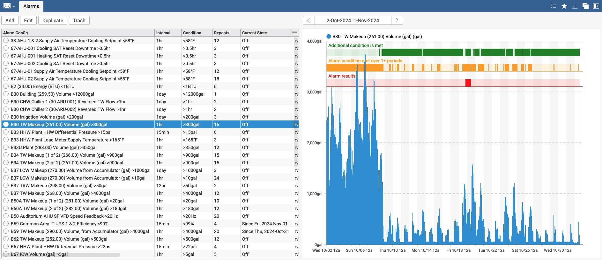

# Data Analysis for Building Operations
Haxall and Haystack Data Analysis for Building Operations.

Currently includes the following modules:
- **hisAlarm** - Generate automated emails based on trends. Tests on consecutive rollup periods are used to reduce false positives. One additional condition can also be applied, for example to exclude periods with high outside air temperatures.
- **hisFormula** - Calculated histories, either live or written into the time series database. Up to 26 data sources per formula. Formulas can be modified over time for a given calculated point. Cluster-aware.

For each module, this repository includes trio files with all required records, including views, templates and funcs. Compiled pods are also available.

# Copyright Notice
Haxall and Haystack Data Analysis for Building Operations (Data Analysis for
Operations) Copyright (c) 2023, The Regents of the University of California,
through Lawrence Berkeley National Laboratory (subject to receipt of any
required approvals from the U.S. Dept. of Energy). All rights reserved.

If you have questions about your rights to use or distribute this software,
please contact Berkeley Lab's Intellectual Property Office at
IPO@lbl.gov.

NOTICE.  This Software was developed under funding from the U.S. Department of
Energy and the U.S. Government consequently retains certain rights.  As such,
the U.S. Government has been granted for itself and others acting on its behalf
a paid-up, nonexclusive, irrevocable, worldwide license in the Software to
reproduce, distribute copies to the public, prepare derivative works, and 
perform publicly and display publicly, and to permit others to do so.

