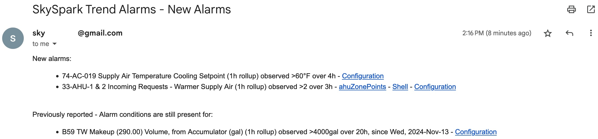

### Main configuration screen

### Sample email generated by hisAlarm

# Copyright Notice
  Haxall and Haystack Data Analysis for Building Operations (Data Analysis for
  Operations) Copyright (c) 2023, The Regents of the University of California,
  through Lawrence Berkeley National Laboratory (subject to receipt of any
  required approvals from the U.S. Dept. of Energy). All rights reserved.

  If you have questions about your rights to use or distribute this software,
  please contact Berkeley Lab's Intellectual Property Office at
  IPO@lbl.gov.

  NOTICE.  This Software was developed under funding from the U.S. Department
  of Energy and the U.S. Government consequently retains certain rights.  As 
  such, the U.S. Government has been granted for itself and others acting on
  its behalf a paid-up, nonexclusive, irrevocable, worldwide license in the 
  Software to reproduce, distribute copies to the public, prepare derivative
  works, and perform publicly and display publicly, and to permit others to do 
  so.

# Module: hisAlarm
History-based alarms, for typical time scales ranging from 15 minutes to several days, with email notifications.
Individual recipients can be configured for each alarm. Sends emails once per event, with reminders every 3 days,
regardless of how often the required task (see below) is configured to run.

Alarms are triggered when the target trend, after applying the desired rollup, meets the configured condition for
a given number of successive periods.

For example, a water meter consumption exceeds 300 gallons every hour for 15 hours in a row.
- `hisRollupInterval: 1hr`
- `alarmCondition: ">300gal"`
- `consecutiveRepeats: 15`

One additional condition can also be applied, for example to exclude periods with high outside air temperatures.
- `additionalPointRef: @abc:xyz Outside Air Temperature`
- `additionalCondition: "<75°F"`

The configuration screen includes a trend viewer to support tuning the settings of each alarm based on historical trends.

Includes trio files with all required records, including app, view, templates, funcs and defs. A compiled pod is
also available, tested with version 3.1.10.

Requires configuring `Settings / Email` with an SMTP server and account.

For automated alarming, a task needs to be configured to call `taskUpdateAlarms()` regularly, for example
every 5 minutes.

# Dependencies
Extension `tools` is required.
