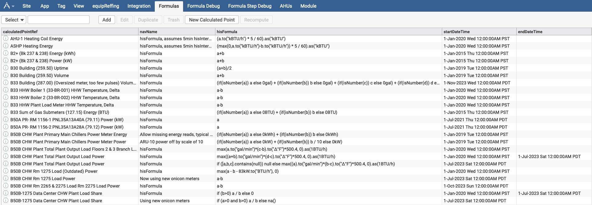
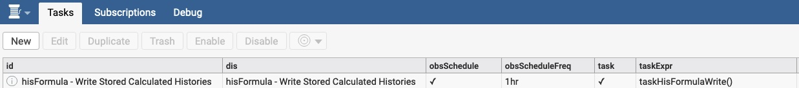

# Copyright Notice
  Haxall and Haystack Data Analysis for Building Operations (Data Analysis for
  Operations) Copyright (c) 2023, The Regents of the University of California,
  through Lawrence Berkeley National Laboratory (subject to receipt of any
  required approvals from the U.S. Dept. of Energy). All rights reserved.

  If you have questions about your rights to use or distribute this software,
  please contact Berkeley Lab's Intellectual Property Office at
  IPO@lbl.gov.

  NOTICE.  This Software was developed under funding from the U.S. Department
  of Energy and the U.S. Government consequently retains certain rights.  As 
  such, the U.S. Government has been granted for itself and others acting on
  its behalf a paid-up, nonexclusive, irrevocable, worldwide license in the 
  Software to reproduce, distribute copies to the public, prepare derivative
  works, and perform publicly and display publicly, and to permit others to do 
  so.

# Module: hisFormula
Calculated histories based on configurable formula records.

**Warning**: Calculated points count against a server's SkySpark license.

Includes trio files with all required records, including views, templates and funcs. A compiled pod is
also available, tested with version 3.1.10.

The main configuration view is located in the default Builder app, and is labeled "Formulas".

The `New Calculated Point` action creates a point and an associated formula.
- equipRef to locate the new, calculated point
- sourcePointRefs to identify all the required points for the formula
- navName of the new, calculated point
- unit of the point
- hisInterval is the rollup interval at which the calculation is performed
- hisMissingVals "Show" fills up missing data with `NA` values, "Hide" leaves them as `null`
- hisFormulaWrite identifies points for which the calculated history is written to the time series database, which requires a task (see below)
- hisRecalculate defines the "hot period" over which written values are erased and recalculated every time the task runs
- hisRollupFunc identifies the rollup function that applies to the new calculated point
- startDateTime is the timestamp after which the formula is valid
- endDateTime is the timestamp after which the formula is no longer valid

For points with calculated histories stored in the time series database, a task needs to be configured
to call `taskHisFormulaWrite()` regularly, for example every 60 minutes.

Multiple formulas for the same calculated point are possible. Use `startDateTime` and `endDateTime` to apply the formulas over the correct period. 
In case several formulas overlap, they all get calculated and the average of the results is returned during the overlap period.

# Dependencies
Extension `tools` is required.

